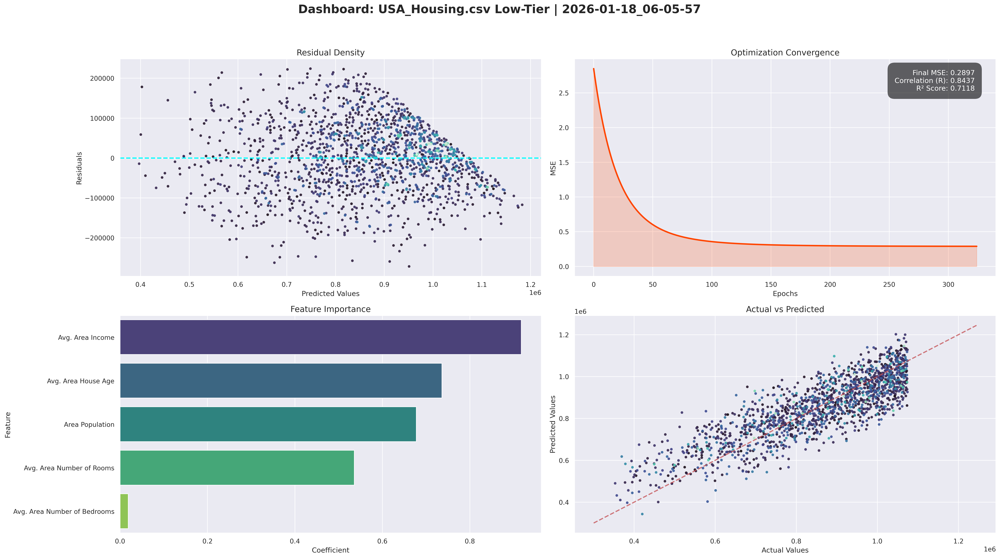
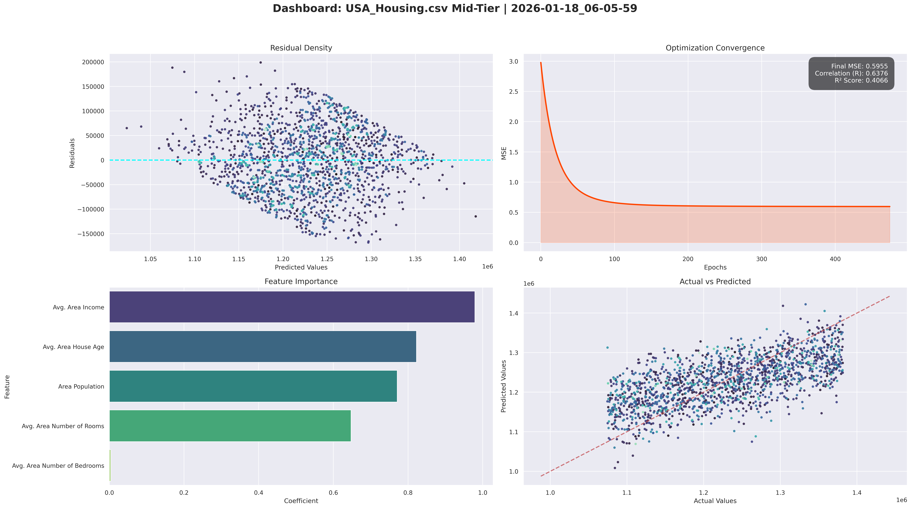
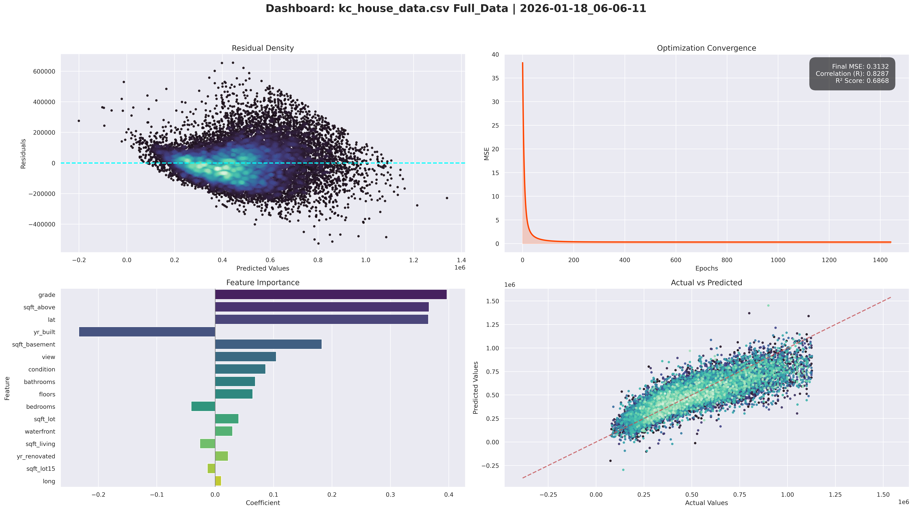
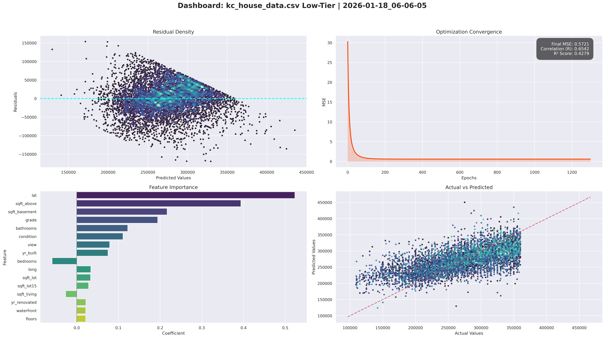
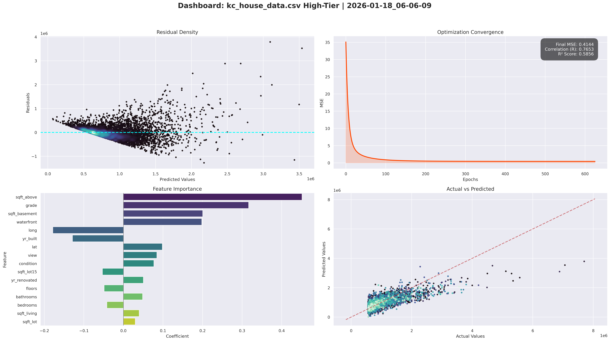
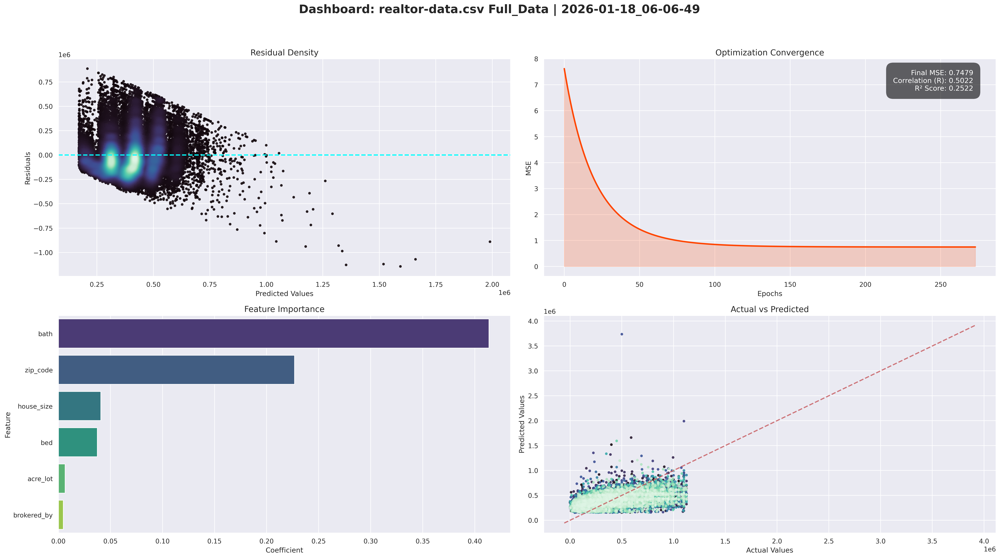
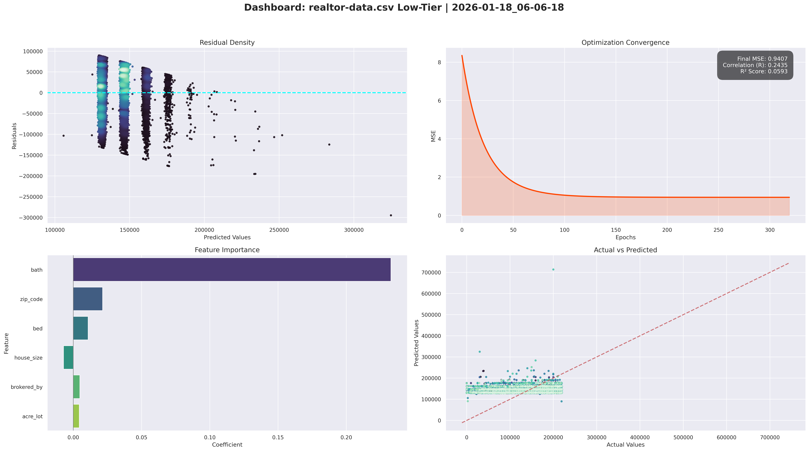
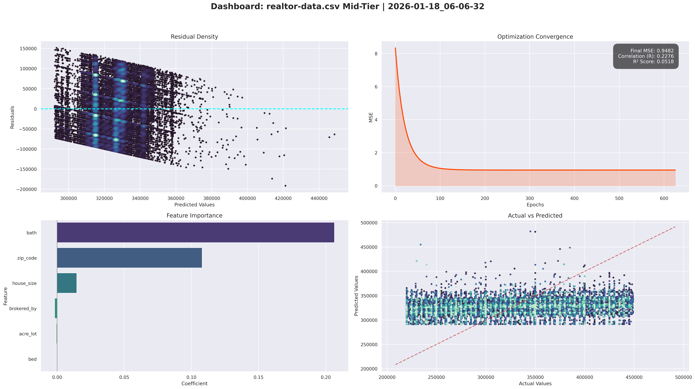
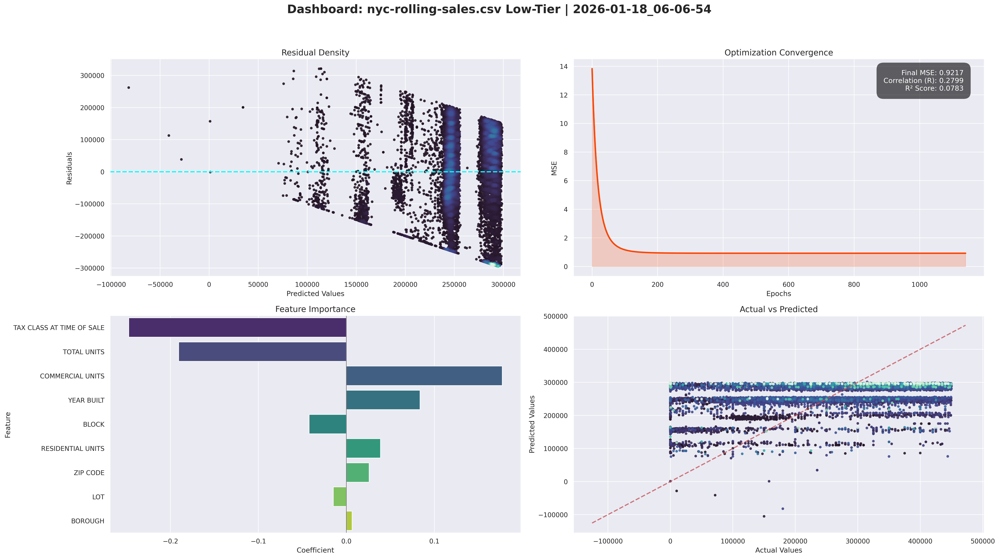

# Housing Price Prediction Model — A Linear Regression Study

**Note:** This is just a personal project. Do not use this to buy a house! The math here is simple and might not be right for real money decisions.

## What is this project?

I built a computer program that tries to guess how much a house costs. It uses a math trick called "Linear Regression." I used four different sets of data from places like the USA, King County, Realtor, and NYC. 

I didn't use any fancy AI libraries. I wrote the math myself to see how it works from the inside.

## How it works ? 

1.  **Gradient Descent**: The computer makes a guess, see how wrong it is, and then fixes its guess. It does this over and over until it gets as close as possible.
2.  **Learning Rate Decay**: At first, the computer makes big changes to its guess. As it gets closer, it makes smaller and smaller changes so it doesn't over-shoot.
3.  **Data Binning (Market Tiers)**: I split the houses into three groups: **Cheap (Low Tier)**, **Middle (Mid Tier)**, and **Expensive (High Tier)**. This is because cheap houses and expensive houses follow different rules.
4.  **Dashboards**: Every time the program runs, it makes a big picture (Dashboard) showing how well it did.

---

## 1. USA Housing Data (Synthetic Control)
This is a fake (synthetic) dataset. It is "perfect" data used to prove that our math engine is stable and works exactly as it should.

### Full Market
The computer did a great job here. It found that **Income** is the most important thing.
*   **R** (Success Score): 0.9566 (Very Good)
*   **R-Squared**: 0.9151
<details>
<summary>Click to see full model metrics</summary>

```text
Timestamp: 2026-01-18 06:06:03.028551
Dataset: USA_Housing.csv
Bin: Full_Data
------------------------------
R-Value: 0.9566
R-Squared: 0.9151
Final MSE: 0.085009
Best Epoch: 264

Feature Importances (Standardized Beta Weights):
  Area Population: 0.4396
  Avg. Area House Age: 0.4758
  Avg. Area Income: 0.6582
  Avg. Area Number of Bedrooms: 0.0199
  Avg. Area Number of Rooms: 0.3359
```
</details>


### Low Tier (Cheap Houses)
*   **Success Score**: 0.8437
*   **What mattered**: Income and Population.
<details>
<summary>Click to see full model metrics</summary>

```text
Timestamp: 2026-01-18 06:05:57.719644
Dataset: USA_Housing.csv
Bin: Low-Tier
------------------------------
R-Value: 0.8437
R-Squared: 0.7118
Final MSE: 0.289728
Best Epoch: 325

Feature Importances (Standardized Beta Weights):
  Area Population: 0.6774
  Avg. Area House Age: 0.7362
  Avg. Area Income: 0.9176
  Avg. Area Number of Bedrooms: 0.0188
  Avg. Area Number of Rooms: 0.5357
```
</details>



### Mid Tier (Average Houses)
This was harder for the computer to guess.
*   **Success Score**: 0.6376
*   **What mattered**: Income.
<details>
<summary>Click to see full model metrics</summary>

```text
Timestamp: 2026-01-18 06:05:59.499714
Dataset: USA_Housing.csv
Bin: Mid-Tier
------------------------------
R-Value: 0.6376
R-Squared: 0.4066
Final MSE: 0.595549
Best Epoch: 475

Feature Importances (Standardized Beta Weights):
  Area Population: 0.7712
  Avg. Area House Age: 0.8228
  Avg. Area Income: 0.9791
  Avg. Area Number of Bedrooms: 0.0035
  Avg. Area Number of Rooms: 0.6476
```
</details>



### High Tier (Expensive Houses)
*   **R** (Success Score): 0.8735
*   **What mattered**: Income and House Age.
<details>
<summary>Click to see full model metrics</summary>

```text
Timestamp: 2026-01-18 06:06:01.265477
Dataset: USA_Housing.csv
Bin: High-Tier
------------------------------
R-Value: 0.8735
R-Squared: 0.7630
Final MSE: 0.237040
Best Epoch: 599

Feature Importances (Standardized Beta Weights):
  Area Population: 0.6276
  Avg. Area House Age: 0.6724
  Avg. Area Income: 0.8668
  Avg. Area Number of Bedrooms: -0.0013
  Avg. Area Number of Rooms: 0.5208
```
</details>


#### Market Logic: Perfect Control
The dashboards for this dataset show a "Perfect Line." The **Actual vs Predicted** dots follow the red line almost exactly. This proves our Gradient Descent engine is mathematically sound and stable.

---

## 2. King County Data (Seattle area)
This is real-world data, so it is a bit messy.

### Full Market
Location and "Grade" (quality) matter most here.
*   **R** (Success Score): 0.8287
*   **R-Squared**: 0.6868
<details>
<summary>Click to see full model metrics</summary>

```text
Timestamp: 2026-01-18 06:06:11.668267
Dataset: kc_house_data.csv
Bin: Full_Data
------------------------------
R-Value: 0.8287
R-Squared: 0.6868
Final MSE: 0.313238
Best Epoch: 1442

Feature Importances (Standardized Beta Weights):
  bathrooms: 0.0686
  bedrooms: -0.0410
  condition: 0.0865
  floors: 0.0643
  grade: 0.3969
  lat: 0.3651
  long: 0.0105
  sqft_above: 0.3663
  sqft_basement: 0.1827
  sqft_living: -0.0263
  sqft_lot: 0.0403
  sqft_lot15: -0.0134
  view: 0.1046
  waterfront: 0.0298
  yr_built: -0.2334
  yr_renovated: 0.0224
```
</details>



### Low Tier (Cheap Houses)
*   **Success Score**: 0.6542
*   **What mattered**: **Latitude** (Where it is north/south). Location is everything for cheap houses.
<details>
<summary>Click to see full model metrics</summary>

```text
Timestamp: 2026-01-18 06:06:05.119169
Dataset: kc_house_data.csv
Bin: Low-Tier
------------------------------
R-Value: 0.6542
R-Squared: 0.4279
Final MSE: 0.572057
Best Epoch: 1377

Feature Importances (Standardized Beta Weights):
  bathrooms: 0.1221
  bedrooms: -0.0590
  condition: 0.1107
  floors: 0.0215
  grade: 0.1940
  lat: 0.5230
  long: 0.0335
  sqft_above: 0.3935
  sqft_basement: 0.2165
  sqft_living: -0.0264
  sqft_lot: 0.0331
  sqft_lot15: 0.0284
  view: 0.0790
  waterfront: 0.0215
  yr_built: 0.0748
  yr_renovated: 0.0219
```
</details>



### Mid Tier (Average Houses)
The hardest part of the market to guess!
*   **Success Score**: 0.3858
*   **What mattered**: Size (Sqft) and Location.
<details>
<summary>Click to see full model metrics</summary>

```text
Timestamp: 2026-01-18 06:06:07.419962
Dataset: kc_house_data.csv
Bin: Mid-Tier
------------------------------
R-Value: 0.3858
R-Squared: 0.1488
Final MSE: 0.851160
Best Epoch: 3625

Feature Importances (Standardized Beta Weights):
  bathrooms: 0.0924
  bedrooms: -0.0833
  condition: 0.0231
  floors: 0.1023
  grade: 0.2589
  lat: 0.2992
  long: 0.0850
  sqft_above: 0.3181
  sqft_basement: 0.2348
  sqft_living: -0.1370
  sqft_lot: 0.0385
  sqft_lot15: 0.0114
  view: 0.0616
  waterfront: 0.0120
  yr_built: -0.2912
  yr_renovated: -0.0099
```
</details>


### High Tier (Expensive Houses)
*   **Success Score**: 0.7653
*   **What mattered**: Size and Grade (Luxury).
<details>
<summary>Click to see full model metrics</summary>

```text
Timestamp: 2026-01-18 06:06:09.423899
Dataset: kc_house_data.csv
Bin: High-Tier
------------------------------
R-Value: 0.7653
R-Squared: 0.5856
Final MSE: 0.414381
Best Epoch: 626

Feature Importances (Standardized Beta Weights):
  bathrooms: 0.0483
  bedrooms: -0.0418
  condition: 0.0770
  floors: -0.0488
  grade: 0.3164
  lat: 0.0983
  long: -0.1785
  sqft_above: 0.4513
  sqft_basement: 0.2004
  sqft_living: 0.0398
  sqft_lot: 0.0299
  sqft_lot15: -0.0532
  view: 0.0844
  waterfront: 0.1978
  yr_built: -0.1288
  yr_renovated: 0.0504
```
</details>



#### Market Logic: The "Funnel" of Uncertainty
The **Residual Density** plot for King County shows a "Funnel Shape." As the price goes up, the errors grow larger. This tells us that linear math is good for cheap homes but gets confused by the unique features of luxury houses. Also, we see a big shift: Cheap houses depend on **Latitude** (Location), but expensive houses depend on **Grade** (Quality).

---

## 3. Realtor Data (USA-wide)
I used 2 million rows of data for this (Updated).

### Full Market
*   **R** (Success Score): 0.5022
*   **R-Squared**: 0.2522
<details>
<summary>Click to see full model metrics</summary>

```text
Timestamp: 2026-01-18 06:06:49.202827
Dataset: realtor-data.csv
Bin: Full_Data
------------------------------
R-Value: 0.5022
R-Squared: 0.2522
Final MSE: 0.747936
Best Epoch: 274

Feature Importances (Standardized Beta Weights):
  acre_lot: 0.0065
  bath: 0.4136
  bed: 0.0374
  brokered_by: 0.0047
  house_size: 0.0408
  zip_code: 0.2269
```
</details>



### Low Tier (Cheap Houses)
*   **Success Score**: 0.2435
*   **What mattered**: Number of Bathrooms.
<details>
<summary>Click to see full model metrics</summary>

```text
Timestamp: 2026-01-18 06:06:18.959481
Dataset: realtor-data.csv
Bin: Low-Tier
------------------------------
R-Value: 0.2435
R-Squared: 0.0593
Final MSE: 0.940738
Best Epoch: 320

Feature Importances (Standardized Beta Weights):
  acre_lot: 0.0044
  bath: 0.2327
  bed: 0.0109
  brokered_by: 0.0048
  house_size: -0.0071
  zip_code: 0.0215
```
</details>



### Mid Tier (Average Houses)
*   **Success Score**: 0.2276
*   **What mattered**: Bathrooms and Zip Code.
<details>
<summary>Click to see full model metrics</summary>

```text
Timestamp: 2026-01-18 06:06:32.620517
Dataset: realtor-data.csv
Bin: Mid-Tier
------------------------------
R-Value: 0.2276
R-Squared: 0.0518
Final MSE: 0.948199
Best Epoch: 2434

Feature Importances (Standardized Beta Weights):
  acre_lot: -0.0006
  bath: 0.2065
  bed: -0.0001
  brokered_by: -0.0018
  house_size: 0.0147
  zip_code: 0.1080
```
</details>



### High Tier (Expensive Houses)
*   **Success Score**: 0.3619
*   **What mattered**: Bathrooms and House Size.
<details>
<summary>Click to see full model metrics</summary>

```text
Timestamp: 2026-01-18 06:06:37.917726
Dataset: realtor-data.csv
Bin: High-Tier
------------------------------
R-Value: 0.3619
R-Squared: 0.1310
Final MSE: 0.869171
Best Epoch: 438

Feature Importances (Standardized Beta Weights):
  acre_lot: 0.0171
  bath: 0.3612
  bed: -0.0826
  brokered_by: -0.0152
  house_size: 0.0966
  zip_code: 0.0712
```
</details>


#### Market Logic: Vertical Stripes & The Bed/Bath Conflict
The **Actual vs Predicted** plot shows "Vertical Stripes." In the Low-Tier market, prices "stick" to round numbers (like $199k). Even if the house size changes, the price stays stuck. 
We also found a **Bed vs Bath Conflict**: Adding a bathroom helps the price, but adding a bedroom actually has a negative weight. In budget homes, more bedrooms often just mean the rooms are too small and cramped.

---

## 4. NYC Rolling Sales
New York is an extremely complicated place for math.

### Full Market
The computer struggled a lot here. Math doesn't like NYC's crazy prices.
*   **R** (Success Score): 0.3449
*   **R-Squared**: 0.1189
<details>
<summary>Click to see full model metrics</summary>

```text
Timestamp: 2026-01-18 06:07:00.993558
Dataset: nyc-rolling-sales.csv
Bin: Full_Data
------------------------------
R-Value: 0.3449
R-Squared: 0.1189
Final MSE: 0.881443
Best Epoch: 300

Feature Importances (Standardized Beta Weights):
  BLOCK: -0.1830
  BOROUGH: -0.1881
  COMMERCIAL UNITS: 0.1448
  LOT: 0.1284
  RESIDENTIAL UNITS: 0.1563
  TAX CLASS AT TIME OF SALE: -0.0827
  TOTAL UNITS: -0.2033
  YEAR BUILT: 0.0600
  ZIP CODE: 0.0094
```
</details>


### Low Tier (Cheap Houses)
*   **Success Score**: 0.2799
*   **What mattered**: Tax Class and Number of Units.
<details>
<summary>Click to see full model metrics</summary>

```text
Timestamp: 2026-01-18 06:06:54.410152
Dataset: nyc-rolling-sales.csv
Bin: Low-Tier
------------------------------
R-Value: 0.2799
R-Squared: 0.0783
Final MSE: 0.921650
Best Epoch: 15662

Feature Importances (Standardized Beta Weights):
  BLOCK: -0.0424
  BOROUGH: 0.0064
  COMMERCIAL UNITS: 0.1771
  LOT: -0.0148
  RESIDENTIAL UNITS: 0.0387
  TAX CLASS AT TIME OF SALE: -0.2475
  TOTAL UNITS: -0.1907
  YEAR BUILT: 0.0838
  ZIP CODE: 0.0258
```
</details>



### Mid Tier (Average Houses)
The computer basically failed to guess these right.
*   **Success Score**: 0.1702
*   **What mattered**: Block and Zip Code.
<details>
<summary>Click to see full model metrics</summary>

```text
Timestamp: 2026-01-18 06:06:56.521977
Dataset: nyc-rolling-sales.csv
Bin: Mid-Tier
------------------------------
R-Value: 0.1702
R-Squared: 0.0290
Final MSE: 0.971085
Best Epoch: 446

Feature Importances (Standardized Beta Weights):
  BLOCK: -0.1011
  BOROUGH: -0.0549
  COMMERCIAL UNITS: 0.0096
  LOT: 0.0607
  RESIDENTIAL UNITS: 0.0279
  TAX CLASS AT TIME OF SALE: 0.0226
  TOTAL UNITS: -0.0303
  YEAR BUILT: 0.0165
  ZIP CODE: 0.0725
```
</details>


### High Tier (Expensive Houses)
*   **Success Score**: 0.2555
*   **What mattered**: How many people can live inside (Residential Units).
<details>
<summary>Click to see full model metrics</summary>

```text
Timestamp: 2026-01-18 06:06:58.653298
Dataset: nyc-rolling-sales.csv
Bin: High-Tier
------------------------------
R-Value: 0.2555
R-Squared: 0.0653
Final MSE: 0.934720
Best Epoch: 621

Feature Importances (Standardized Beta Weights):
  BLOCK: -0.0196
  BOROUGH: -0.0258
  COMMERCIAL UNITS: 0.1253
  LOT: -0.0414
  RESIDENTIAL UNITS: 0.1877
  TAX CLASS AT TIME OF SALE: 0.1222
  TOTAL UNITS: -0.0260
  YEAR BUILT: 0.0083
  ZIP CODE: -0.0139
```
</details>


#### Market Logic: The "Flatline" Guess
In NYC, the **Actual vs Predicted** plot is almost a horizontal line for the Mid-Tier. This means the computer has given up on using the features and is just guessing the middle price for every house. The math is "throwing in the towel" because urban prices follow rules (like zoning and historical value) that simple linear filters cannot see.

---

## Summary of Results

This table shows a big summary of how the computer did in every market.

| Dataset | Market Tier | Success Score (R) | Accuracy ($R^2$) | Biggest Factor |
| :--- | :--- | :--- | :--- | :--- |
| **King County** | Full | 0.8287 | 0.6868 | Grade / Size |
| | Low | 0.6542 | 0.4279 | Location (Lat) |
| | Mid | 0.3858 | 0.1488 | Size |
| | High | 0.7653 | 0.5856 | Size / Quality |
| **Realtor Data**| Full | 0.5022 | 0.2522 | Bathrooms |
| | Low | 0.2435 | 0.0593 | Bathrooms |
| | Mid | 0.2276 | 0.0518 | Bathrooms |
| | High | 0.3619 | 0.1310 | Bathrooms |
| **NYC Sales** | Full | 0.3449 | 0.1189 | Unit Count |
| | Low | 0.2799 | 0.0783 | Tax Class |
| | Mid | 0.1702 | 0.0290 | Zip Code |
| | High | 0.2555 | 0.0653 | Residential Units |

---

## Datasets Used

The following datasets were used to train and evaluate the model:

1. **USA Housing**: [USA Housing Dataset (Kaggle)](https://www.kaggle.com/datasets/kanths028/usa-housing)
2. **King County**: [House Sales in King County, USA (Kaggle)](https://www.kaggle.com/datasets/harlfoxem/housesalesprediction)
3. **Realtor Data**: [USA Real Estate Dataset (Kaggle)](https://www.kaggle.com/datasets/ahmedshahriarsakib/usa-real-estate-dataset)
4. **NYC Rolling Sales**: [NYC Property Sales (Kaggle)](https://www.kaggle.com/datasets/new-york-city/nyc-property-sales)

---

## Conclusion: A Lesson in Underfitting

I have three big takeaways after looking at all 16 dashboards:

### 1. The "Flatline" Failure (Underfitting)
In messy markets like NYC and the Realtor-wide Low-Tier, our model "threw in the towel." You can see this in the **Actual vs Predicted** plots where the dots form a flat horizontal line. 
*   **The Problem**: The model realized it couldn't understand the chaos, so it played it safe by guessing the "average price" for almost every house. 
*   **The Lesson**: This is a classic case of **Underfitting**. A simple straight-line math equation is too basic for real-world markets where property history, condition, and local laws matter more than size.

### 2. The "Middle-Class" Predictability Gap
Average houses (Mid-Tier) were consistently the hardest to predict across all datasets. 
*   Cheap houses follow simple rules (Location). 
*   Expensive houses follow simple rules (Quality). 
*   **Middle houses are chaotic.** Buyers in this range are more picky and have more choices, which makes their behavior non-linear and hard for this simple model to see.

### 3. Markets are "Sticky"
The "Vertical Stripes" in the Realtor dashboards show that in real life, prices are "sticky." They cluster around round numbers (like $199k) regardless of house features. Our linear model tries to find a smooth slope, but the market moves in blocks, causing the math to fail.

**Final Verdict:** This project proves that while our math engine is stable (hitting 95% on synthetic data), **Real-World Housing is NOT Linear.** To get better accuracy, we would need much more complex math that can understand "market soul" and local urban chaos.
