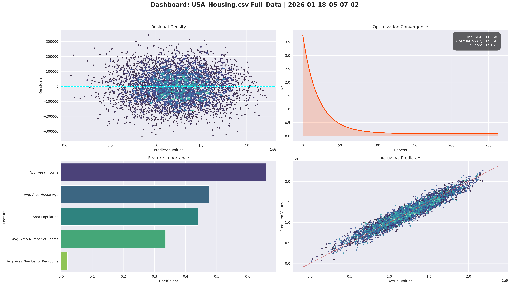
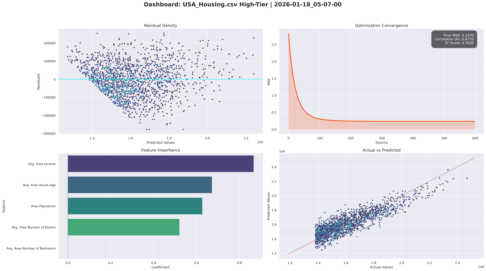
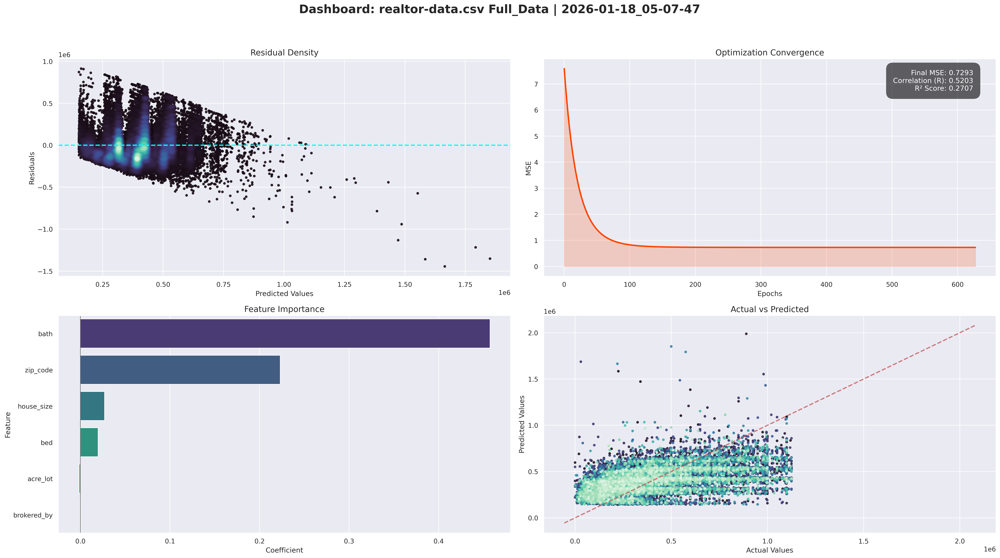
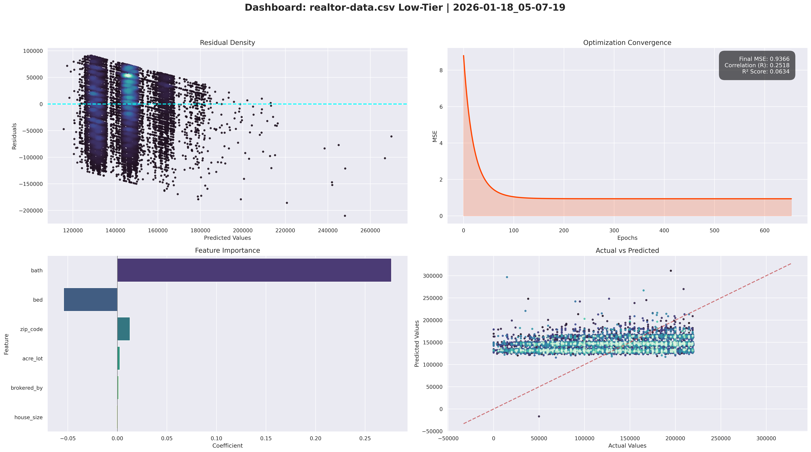
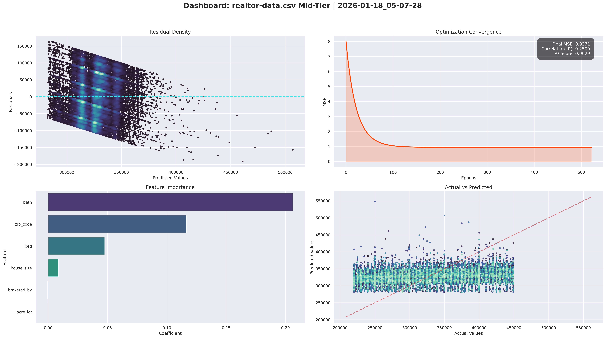
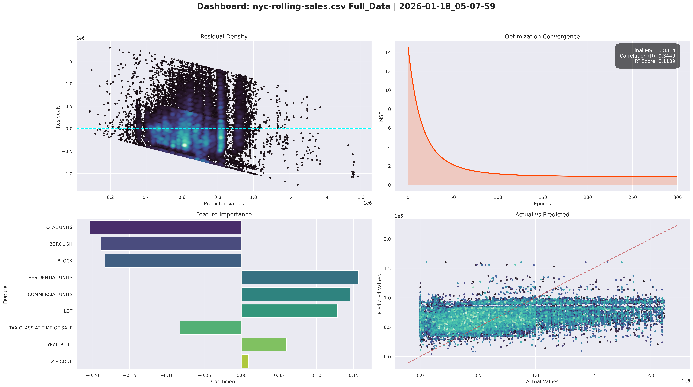
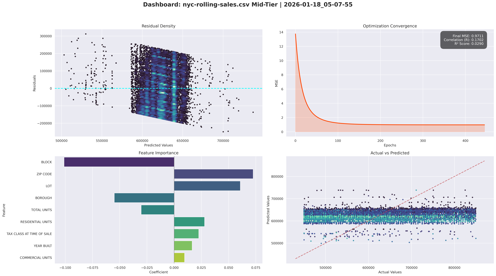
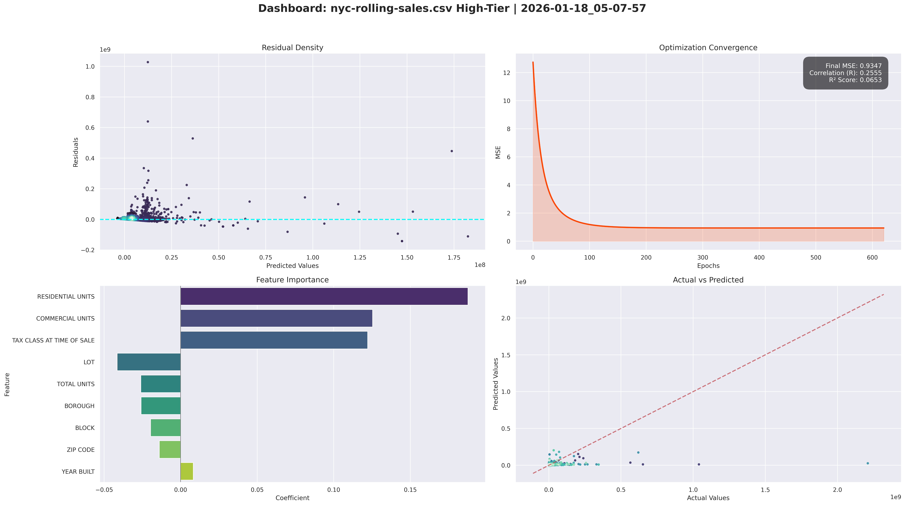

# Housing Price Prediction Model — A Linear Regression Study

**Note:** This is just a personal project. Do not use this to buy a house! The math here is simple and might not be right for real money decisions.

## What is this project?

I built a computer program that tries to guess how much a house costs. It uses a math trick called "Linear Regression." I used four different sets of data from places like the USA, King County, Realtor, and NYC. 

I didn't use any fancy AI libraries. I wrote the math myself to see how it works from the inside.

## How it works ? 

1.  **Gradient Descent**: The computer makes a guess, see how wrong it is, and then fixes its guess. It does this over and over until it gets as close as possible.
2.  **Learning Rate Decay**: At first, the computer makes big changes to its guess. As it gets closer, it makes smaller and smaller changes so it doesn't over-shoot.
3.  **Data Binning (Market Tiers)**: I split the houses into three groups: **Cheap (Low Tier)**, **Middle (Mid Tier)**, and **Expensive (High Tier)**. This is because cheap houses and expensive houses follow different rules.
4.  **Dashboards**: Every time the program runs, it makes a big picture (Dashboard) showing how well it did.

---

## 1. USA Housing Data (Synthetic Control)
This is a fake (synthetic) dataset. It is "perfect" data used to prove that our math engine is stable and works exactly as it should.

### Full Market
The computer did a great job here. It found that **Income** is the most important thing.
*   **R** (Success Score): 0.9566 (Very Good)
*   **R-Squared**: 0.9151

### Low Tier (Cheap Houses)
*   **Success Score**: 0.8437
*   **What mattered**: Income and Population.

### Mid Tier (Average Houses)
This was harder for the computer to guess.
*   **Success Score**: 0.6376
*   **What mattered**: Income.

### High Tier (Expensive Houses)
*   **R** (Success Score): 0.8735
*   **What mattered**: Income and House Age.

#### Market Logic: Perfect Control
The dashboards for this dataset show a "Perfect Line." The **Actual vs Predicted** dots follow the red line almost exactly. This proves our Gradient Descent engine is mathematically sound and stable.

---

## 2. King County Data (Seattle area)
This is real-world data, so it is a bit messy.

### Full Market
Location and "Grade" (quality) matter most here.
*   **R** (Success Score): 0.8287
*   **R-Squared**: 0.6868

### Low Tier (Cheap Houses)
*   **Success Score**: 0.6542
*   **What mattered**: **Latitude** (Where it is north/south). Location is everything for cheap houses.

### Mid Tier (Average Houses)
The hardest part of the market to guess!
*   **Success Score**: 0.3858
*   **What mattered**: Size (Sqft) and Location.

### High Tier (Expensive Houses)
*   **Success Score**: 0.7653
*   **What mattered**: Size and Grade (Luxury).

#### Market Logic: The "Funnel" of Uncertainty
The **Residual Density** plot for King County shows a "Funnel Shape." As the price goes up, the errors grow larger. This tells us that linear math is good for cheap homes but gets confused by the unique features of luxury houses. Also, we see a big shift: Cheap houses depend on **Latitude** (Location), but expensive houses depend on **Grade** (Quality).

---

## 3. Realtor Data (USA-wide)
I used 1 million rows of data for this.

### Full Market
*   **R** (Success Score): 0.5203
*   **R-Squared**: 0.2707

### Low Tier (Cheap Houses)
*   **Success Score**: 0.2518
*   **What mattered**: Number of Bathrooms.

### Mid Tier (Average Houses)
*   **Success Score**: 0.2509
*   **What mattered**: Bathrooms and Zip Code.

### High Tier (Expensive Houses)
*   **Success Score**: 0.4182
*   **What mattered**: Bathrooms and House Size.

#### Market Logic: Vertical Stripes & The Bed/Bath Conflict
The **Actual vs Predicted** plot shows "Vertical Stripes." In the Low-Tier market, prices "stick" to round numbers (like $199k). Even if the house size changes, the price stays stuck. 
We also found a **Bed vs Bath Conflict**: Adding a bathroom helps the price, but adding a bedroom actually has a negative weight (-0.06). In budget homes, more bedrooms often just mean the rooms are too small and cramped.

---

## 4. NYC Rolling Sales
New York is an extremely complicated place for math.

### Full Market
The computer struggled a lot here. Math doesn't like NYC's crazy prices.
*   **R** (Success Score): 0.3449
*   **R-Squared**: 0.1189

### Low Tier (Cheap Houses)
*   **Success Score**: 0.2799
*   **What mattered**: Tax Class and Number of Units.

### Mid Tier (Average Houses)
The computer basically failed to guess these right.
*   **Success Score**: 0.1702
*   **What mattered**: Block and Zip Code.

### High Tier (Expensive Houses)
*   **Success Score**: 0.2555
*   **What mattered**: How many people can live inside (Residential Units).

#### Market Logic: The "Flatline" Guess
In NYC, the **Actual vs Predicted** plot is almost a horizontal line for the Mid-Tier. This means the computer has given up on using the features and is just guessing the middle price for every house. The math is "throwing in the towel" because urban prices follow rules (like zoning and historical value) that simple linear filters cannot see.

---

## Summary of Results

This table shows a big summary of how the computer did in every market.

| Dataset | Market Tier | Success Score (R) | Accuracy ($R^2$) | Biggest Factor |
| :--- | :--- | :--- | :--- | :--- |
| **King County** | Full | 0.8287 | 0.6868 | Grade / Size |
| | Low | 0.6542 | 0.4279 | Location (Lat) |
| | Mid | 0.3858 | 0.1488 | Size |
| | High | 0.7653 | 0.5856 | Size / Quality |
| **Realtor Data**| Full | 0.5203 | 0.2707 | Bathrooms |
| | Low | 0.2518 | 0.0634 | Bathrooms |
| | Mid | 0.2509 | 0.0629 | Bathrooms |
| | High | 0.4182 | 0.1749 | Bathrooms |
| **NYC Sales** | Full | 0.3449 | 0.1189 | Unit Count |
| | Low | 0.2799 | 0.0783 | Tax Class |
| | Mid | 0.1702 | 0.0290 | Zip Code |
| | High | 0.2555 | 0.0653 | Residential Units |

---

## Datasets Used

The following datasets were used to train and evaluate the model:

1. **USA Housing**: [USA Housing Dataset (Kaggle)](https://www.kaggle.com/datasets/kanths028/usa-housing)
2. **King County**: [House Sales in King County, USA (Kaggle)](https://www.kaggle.com/datasets/harlfoxem/housesalesprediction)
3. **Realtor Data**: [USA Real Estate Dataset (Kaggle)](https://www.kaggle.com/datasets/ahmedshahriarsakib/usa-real-estate-dataset)
4. **NYC Rolling Sales**: [NYC Property Sales (Kaggle)](https://www.kaggle.com/datasets/new-york-city/nyc-property-sales)

---

## Conclusion: A Lesson in Underfitting

I have three big takeaways after looking at all 16 dashboards:

### 1. The "Flatline" Failure (Underfitting)
In messy markets like NYC and the Realtor-wide Low-Tier, our model "threw in the towel." You can see this in the **Actual vs Predicted** plots where the dots form a flat horizontal line. 
*   **The Problem**: The model realized it couldn't understand the chaos, so it played it safe by guessing the "average price" for almost every house. 
*   **The Lesson**: This is a classic case of **Underfitting**. A simple straight-line math equation is too basic for real-world markets where property history, condition, and local laws matter more than size.

### 2. The "Middle-Class" Predictability Gap
Average houses (Mid-Tier) were consistently the hardest to predict across all datasets. 
*   Cheap houses follow simple rules (Location). 
*   Expensive houses follow simple rules (Quality). 
*   **Middle houses are chaotic.** Buyers in this range are more picky and have more choices, which makes their behavior non-linear and hard for this simple model to see.

### 3. Markets are "Anchored"
The "Vertical Stripes" in the Realtor dashboards show that in real life, prices are "anchored." They cluster around round numbers (like $199k) regardless of house features. Our linear model tries to find a smooth slope, but the market moves in blocks, causing the math to fail.

**Final Verdict:** This project proves that while our math engine is stable (hitting 95% on synthetic data), **Real-World Housing is NOT Linear.** To get better accuracy, we would need much more complex math that can understand "market soul" and local urban chaos.
