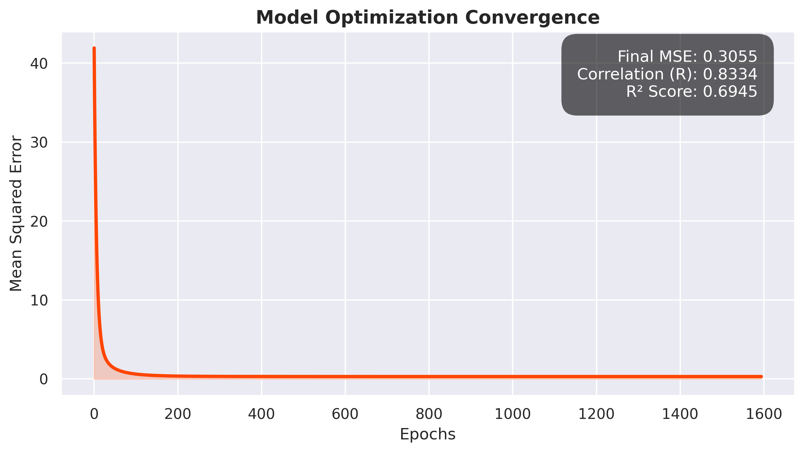

# Housing Price Prediction Model — A Linear Regression Study

**Disclaimer:** This project is for educational and research purposes only. The pricing predictions are generated by a mathematical model and should not be used as financial or real estate advice. The author assumes no responsibility for any decisions made based on this code.

## Introduction

This project implements a custom **Multivariate Linear Regression** model from scratch to predict housing prices. By utilizing a gradient descent approach with feature scaling, the script determines how various socioeconomic and structural factors (such as area income, house age, and population) impact real estate value.

The implementation focuses on the mathematical foundations of machine learning, intentionally avoiding high-level libraries like Scikit-Learn for the model logic itself to better understand optimization and convergence mechanics.

## Technical Implementation

The custom engine is built for stability and reproducibility, featuring:

* **Optimization:** Implements **Gradient Descent with Learning Rate Decay** to strictly control step sizes and prevent overshoot during convergence.
* **Preprocessing:** Manual implementation of `StandardScaler` to normalize features (Z-score normalization), ensuring that all $\theta$ weights are on a comparable scale for efficient gradient updates.
* **Robust Logging:** An automated system using a custom `Logger` class and `sys.excepthook` that captures console outputs and error tracebacks with timestamps.
* **Directory Structure:**
    * `logs/logs_test`: Stores session history, user inputs, and model metrics.
    * `images/`: Stores generated visualizations (residual plots, loss convergence, feature importance).

## Mathematical Foundations

The model relies on core mathematical mechanics to achieve convergence:

### 1. Hypothesis Function
The linear relationship is defined as the weighted sum of inputs:
$$\hat{y} = \theta^T X = \theta_0 + \theta_1x_1 + \dots + \theta_nx_n$$

### 2. Cost Function: Mean Squared Error (MSE)
We measure accuracy by minimizing the average squared difference between predicted and actual values:
$$J(\theta) = \frac{1}{n} \sum_{i=1}^{n} (y_i - \hat{y}_i)^2$$

### 3. Optimization: Gradient Descent
Weights are updated iteratively by moving against the gradient of the cost function:
$$\theta_j := \theta_j - \alpha \frac{\partial J}{\partial \theta_j}$$

Where the partial derivative is:
$$\frac{\partial J}{\partial \theta_j} = \frac{2}{n} \sum_{i=1}^{n} (\hat{y}_i - y_i) \cdot x_{ij}$$

---

## Model Outputs & Visual Evaluations

### 1. Model for USA_Housing.csv
```text
----- Model for USA_Housing.csv -----
This model contains 5000 datapoints
Model Features:
Area Population
Avg. Area House Age
Avg. Area Income
Avg. Area Number of Bedrooms
Avg. Area Number of Rooms
mse= 0.08198227969880013
Model Correlation (R): 0.9581
R-Squared: 0.9180

--- Feature Importance (Beta Values) ---
Area Population: 0.4276
Avg. Area House Age: 0.4652
Avg. Area Income: 0.6513
Avg. Area Number of Bedrooms: 0.0081
Avg. Area Number of Rooms: 0.3414

```

**Visual Evaluations:**

 

### Loss Curve


 

### 2. Model for kc_house_data.csv

```text
----- Model for kc_house_data.csv -----
This model contains 21613 datapoints
Model Features:
bathrooms
bedrooms
condition
floors
grade
lat
long
sqft_above
sqft_basement
sqft_living
sqft_lot
sqft_lot15
view
waterfront
yr_built
yr_renovated
mse= 0.3055074137104961
Model Correlation (R): 0.8334
R-Squared: 0.6945

--- Feature Importance (Beta Values) ---
bathrooms: 0.0784
bedrooms: -0.0863
condition: 0.0555
floors: -0.0027
grade: 0.3236
lat: 0.2137
long: -0.0387
sqft_above: 0.3929
sqft_basement: 0.1646
sqft_living: 0.0501
sqft_lot: 0.0121
sqft_lot15: -0.0278
view: 0.1089
waterfront: 0.1374
yr_built: -0.1915
yr_renovated: 0.0235

```

**Visual Evaluations:**
 



 

### Datasets Used

* [USA Housing Dataset](https://www.kaggle.com/datasets/aariyan101/usa-housingcsv)
* [King County House Sales Dataset](https://www.kaggle.com/datasets/harlfoxem/housesalesprediction)

---

## Experimental Results

The model was tested on two distinct datasets to evaluate its versatility against both synthetic (highly linear) and real-world (noisy) data.

| Dataset | Data Points | MSE | Correlation () |  Score | Dominant Feature |
| --- | --- | --- | --- | --- | --- |
| **USA_Housing.csv** | 5,000 | `0.0820` | **0.9581** | **0.9180** | Avg. Area Income () |
| **kc_house_data.csv** | 21,613 | `0.3055` | **0.8334** | **0.6945** | Sqft Above () |

---

## Conclusion & Insights

This study highlights the contrast between ideal theoretical conditions (USA Housing) and real-world market complexity (King County).

### 1. Contextual Drivers

* **USA Dataset (Wealth Driven):** The primary drivers were demographic. `Avg. Area Income` () and `Avg. Area House Age` () largely determined price, resulting in a near-perfect linear fit ().
* **King County Dataset (Structure Driven):** The primary drivers were physical. `sqft_above` () and `grade` () dominated the model.

### 2. The Bedroom Paradox

In the King County dataset, **bedrooms** showed a negative coefficient (). This is a counter-intuitive finding that likely indicates **multicollinearity**.

> **Insight:** When `sqft_living` is held constant, increasing the number of bedrooms implies smaller individual rooms, which may decrease the overall value of the property.

### 3. Geospatial Impact

The high importance of **Latitude** () in King County suggests that location is a primary linear predictor in real-world markets. A house's value is heavily dependent on *where* it is, not just *what* it is.

### Future Work

To improve the  on the King County dataset (currently ), future iterations will explore:

* **Regularization:** Implementing Ridge (L2) or Lasso (L1) regression to handle the multicollinearity observed between bedrooms and square footage.
* **Polynomial Features:** Introducing non-linear terms to capture the diminishing returns of house age or the compounding value of very large properties.
* **Geospatial Clustering:** Using K-Means to cluster neighborhoods as a categorical feature instead of treating raw `lat`/`long` coordinates as linear inputs.

