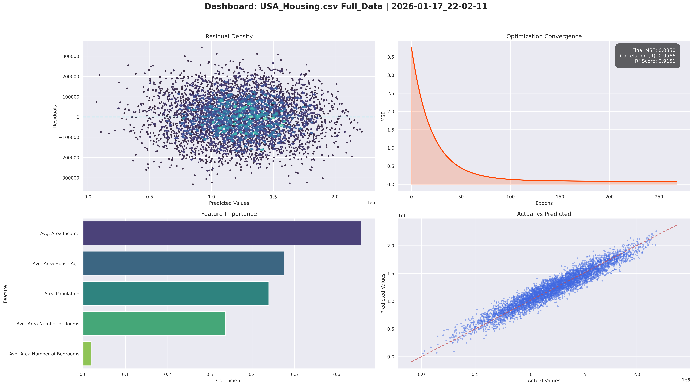
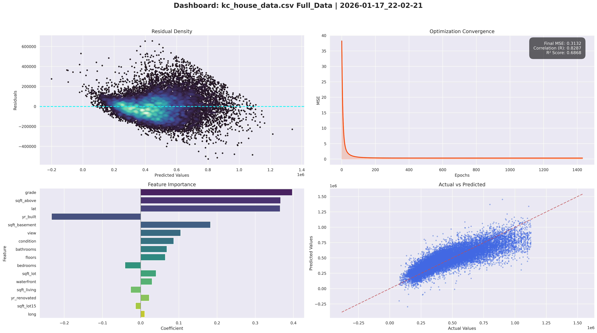
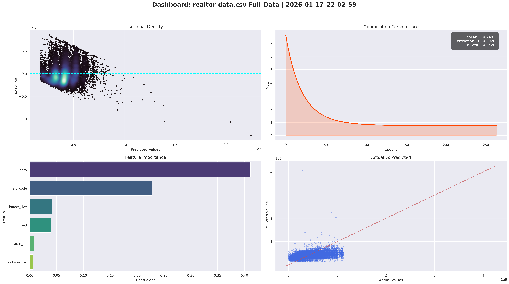
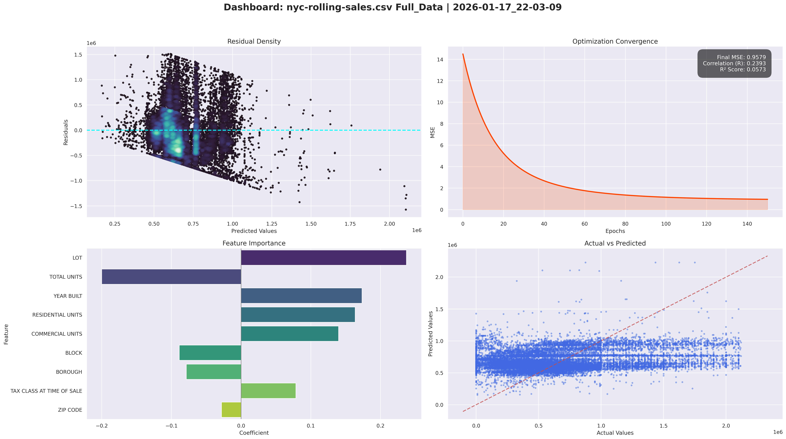

# Housing Price Prediction Model — A Linear Regression Study

**Disclaimer:** This project is for educational and research purposes only. The pricing predictions are generated by a mathematical model and should not be used as financial or real estate advice. The author assumes no responsibility for any decisions made based on this code.

## Introduction    

This project implements a custom **Multivariate Linear Regression** model from scratch to predict housing prices across multiple global datasets (USA, King County, Realtor Data, and NYC). By utilizing a gradient descent approach with feature scaling and market segmentation, the script determines how various socioeconomic and structural factors impact real estate value.

The implementation focuses on the mathematical foundations of machine learning, intentionally avoiding high-level libraries like Scikit-Learn for the model logic itself to better understand optimization, convergence mechanics, and market tiers.

## Technical Implementation

The custom engine is built for stability, scalability, and deep market insight:

* **Optimization:** Implements **Gradient Descent with Learning Rate Decay** and **Early Stopping** (patience-based) to ensure optimal convergence without overfitting.
* **Market Segmentation (Binning):** Automatically segments datasets into **Low, Mid, and High Tiers** based on price quantiles, allowing for localized feature importance analysis.
* **Massive Data Handling:** Features automated **sampling** (e.g., 1M rows for Realtor data) to maintain high performance with limited RAM.
* **Preprocessing:** Manual implementation of `StandardScaler` to normalize features (Z-score normalization).
* **Automated Reporting:** Each run generates a comprehensive **Dashboard** visualization and a `model_metrics.txt` summary within dataset-specific folders.

## Mathematical Foundations

The model relies on core mathematical mechanics:

### 1. Hypothesis Function
$$\hat{y} = \theta^T X = \theta_0 + \theta_1x_1 + \dots + \theta_nx_n$$

### 2. Cost Function: Mean Squared Error (MSE)
$$J(\theta) = \frac{1}{n} \sum_{i=1}^{n} (y_i - \hat{y}_i)^2$$

### 3. Optimization: Gradient Descent
$$\theta_j := \theta_j - \alpha \frac{\partial J}{\partial \theta_j}$$

---

## Experimental Results

The model was tested across four distinct datasets representing varied market conditions.

| Dataset | Data Points | MSE | Correlation ($R$) | $R^2$ Score | Top Predictor |
| :--- | :--- | :--- | :--- | :--- | :--- |
| **USA Housing** | 5,000 | `0.0850` | **0.9566** | **0.9151** | Area Income |
| **King County** | 21,613 | `0.3132` | **0.8287** | **0.6868** | Grade / Sqft Above |
| **Realtor Data** | 1,000,000* | `0.7482` | **0.5020** | **0.2520** | Bathrooms / Zip Code |
| **NYC Rolling Sales** | 59,759 | `0.9579` | **0.2393** | **0.0573** | Lot / Year Built |

*\*Sampled for optimization*

---

## Detailed Analysis & Visualizations

### 1. USA Housing Analysis
*High linearity, demographics-driven.*

### 2. King County Analysis
*Structural and geospatial drivers.*

### 3. Realtor Data (sampled)
*Broad market trends across the US.*

### 4. NYC Rolling Sales
*Highest complexity, non-linear urban market.*

---

## Conclusion & Insights

### 1. The Linearity Spectrum
* **Ideal Markets (USA Housing):** Highly predictable ($R^2 > 0.9$) when wealth markers (Income) are available.
* **Noisy Markets (NYC):** Low predictability ($R^2 < 0.1$) due to regulatory complexity, zoning, and high variance in urban sales which require more than linear modeling.

### 2. Tiered Market Behavior
The **Data Binning** feature revealed that feature importance shifts between price tiers. For example, in King County, geospatial impact (`lat`) is often more critical in Low-Tier markets, while structural `grade` dominates Mid and High-Tier evaluations.

### 3. The Multi-Collinearity Challenge
Datasets like King County exhibit the "Bedroom Paradox," where adding bedrooms can negatively impact price if living area remains constant, suggesting that room density negatively correlates with luxury.

## Future Work

* **Regularization:** Ridge/Lasso to penalize highly correlated features.
* **Polynomial Expansion:** To capture non-linear relationships in urban datasets like NYC.
* **Geospatial Clustering:** moving beyond raw Lat/Long to neighborhood-cluster features.

