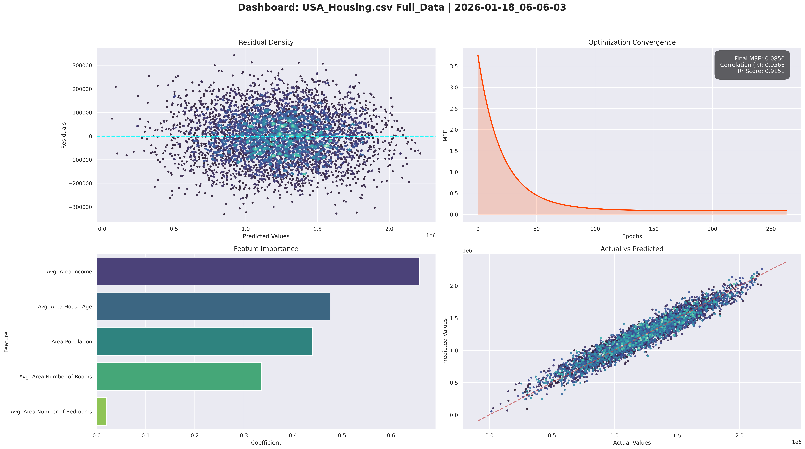
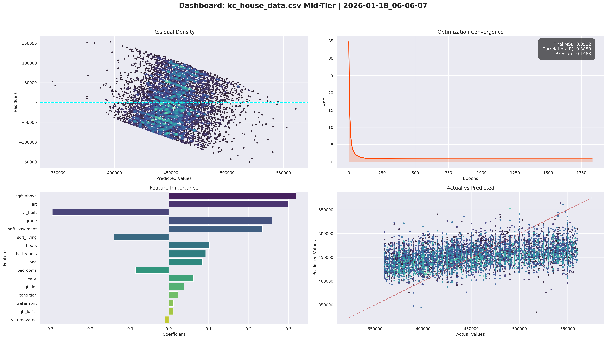
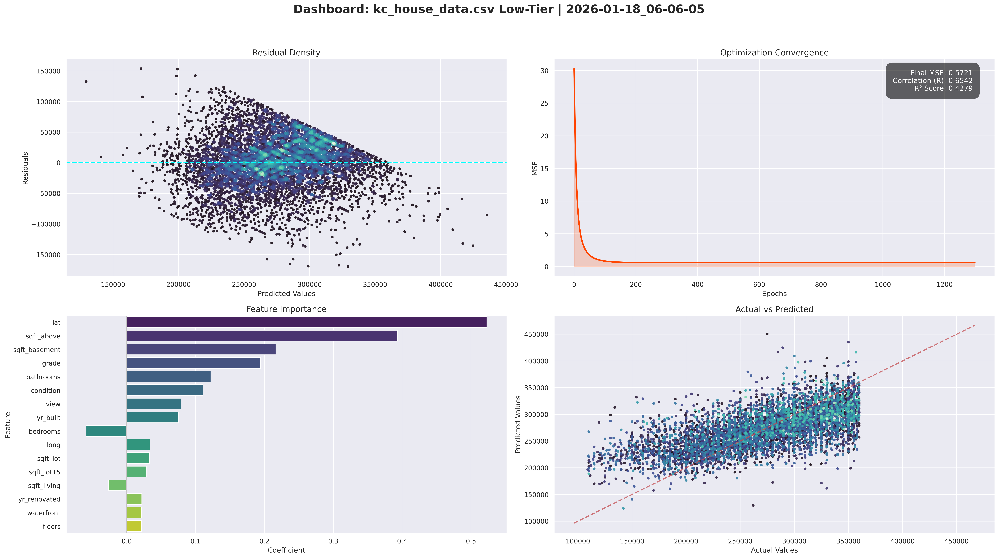

# Multiple Linear Regression - From Scratch (Matrices)

## Why I built this

I built this project to properly understand the math behind Linear Regression. Instead of just calling `model.fit()` from `scikit-learn`, I wanted to implement the actual Matrix operations and Gradient Descent logic myself in Python.

It's a personal implementation to learn how the algorithm actually optimizes weights to fit a line.

## How it works

The core logic uses:
1.  **Gradient Descent**: Starts with random weights and tweaks them to reduce error.
2.  **Learning Rate Decay**: Takes smaller steps as it gets closer to the answer so it doesn't overshoot.
3.  **Data Binning**: I split the data into **Low**, **Mid**, and **High** price tiers to see if the model behaves differently for cheap vs expensive houses.

---

## 1. USA Housing Data (Synthetic)

I used this synthetic dataset just to check if my code was working correctly.

Since the data is perfect, my model worked perfectly too (**95% accuracy**). The red line matches the dots exactly, which confirmed my matrix math is correct.

---

## 2. King County (Real Data)

This was the actual test using real house prices from Seattle.

Accuracy dropped to about **68%**, which is expected since real life data is messy. But I found some interesting patterns when looking at the different price tiers.

### The "Mid-Tier" Confusion
The model really struggled with average-priced houses (R² was only **0.14**).
It seems the middle-class market is just too chaotic for a simple linear equation. Buyers here have too many choices and variables, so the prices don't follow a strict rule.

### Location vs Quality
*   **Cheap Houses**: Price depends mostly on **Location** (Latitude).
*   **Expensive Houses**: Price depends mostly on **Construction Grade**.

---

## What I learned

This was a good exercise to learn Linear Algebra application.
*   **Math works**: My manual implementation gives the same results as standard libraries.
*   **Linear models are limited**: They work great for simple trends, but for complex real-world markets (especially that mid-tier mess), they fall short.
*   **Next steps**: To actually predict prices accurately in the real world, I'd probably use a **Random Forest** or XGBoost model next time to handle the non-linear variance better.
